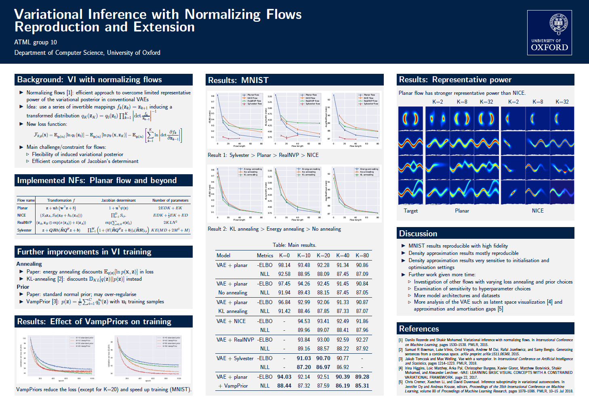

# Variational Inference with Normalizing Flows 
Reproduced and extended by ATML Group 10



To run MNIST experiments:
```train
python main_experiment_VAE.py --flow planar --num_flows 10
```

To run representative power experiment:
See the [jupyter notebook](https://github.com/andrehuang/normalizing-flows-reproduce/blob/main/representative_power_experiment/density_matching_planar.ipynb).
